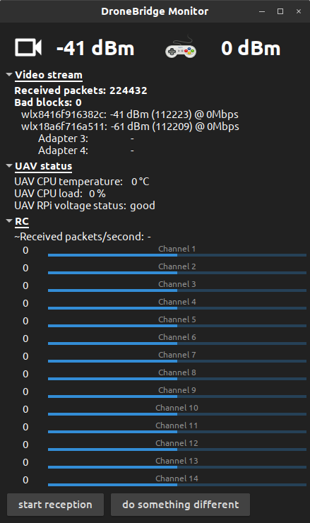

# DroneBridge for Desktop
Moules &amp; kernel patches to compile a working linux image (x86/ AMD64) that can be used as a ground station for the DroneBridge system. It can be used instead of the Raspberry Pi ground station. A working image based on Linux Mint 19 (x64) is provided.

The image comes with all sorts of preinstalled tools like:
* iNAV configurator
* AMPPlanner
* QGroundControl
* mwptools

Additionally to all DroneBridge Raspberry Pi modules there are new modules:
 * monitor module: Display information about lost packets, RC & UAV Pi

 DroneBridge for Desktop is a fully capable ground station for the DroneBridge system. It can receive and process the DroneBridge raw protocol. Its Kernel is patched with the same modifications as the "original" Raspberry Pi images. DroneBridge for Desktop can be used to receive and transmit data over a long range link, however the main focus is on receiving & RC (ground station functionality)

 ## DroneBridge Monitor

